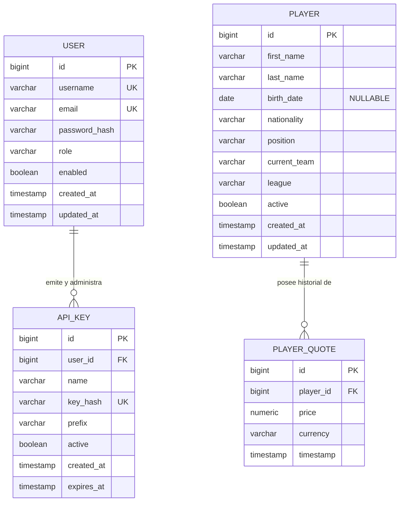

# Data Model Specification: Entrega 1 — Foundation

**Feature**: `001-entrega1-foundation`  
**Date**: 2026-09-16  
**Status**: Completed  

Este documento define el modelo de datos formal, esquema relacional, restricciones de persistencia y reglas de validación correspondientes a la **Entrega 1 — Foundation** de la *Plataforma de Mercado y Valoración de Jugadores de Fútbol*.

---

## 1. Diagrama Entidad-Relación (ER)

---

## 2. Definición Detallada de Entidades

### 2.1 Entidad `User` (`users`)

Representa la cuenta de un usuario en el sistema.

| Columna | Tipo SQL | Tipo Java | Restricciones | Descripción |
| :--- | :--- | :--- | :--- | :--- |
| `id` | `BIGSERIAL` | `Long` | `PRIMARY KEY` | Identificador autoincremental único. |
| `username` | `VARCHAR(50)` | `String` | `NOT NULL`, `UNIQUE` | Nombre de usuario único para login (3 a 30 caracteres). |
| `email` | `VARCHAR(100)` | `String` | `NOT NULL`, `UNIQUE` | Correo electrónico en formato RFC 5322 válido. |
| `password_hash` | `VARCHAR(100)` | `String` | `NOT NULL` | Hash BCrypt de la contraseña (cost factor 10 o 12). |
| `role` | `VARCHAR(20)` | `UserRole` (Enum) | `NOT NULL` | Rol de autorización (`ROLE_USER`, `ROLE_ADMIN`). |
| `enabled` | `BOOLEAN` | `Boolean` | `NOT NULL`, `DEFAULT TRUE` | Indica si la cuenta se encuentra activa. |
| `created_at` | `TIMESTAMP` | `LocalDateTime` | `NOT NULL` | Fecha y hora de creación del registro. |
| `updated_at` | `TIMESTAMP` | `LocalDateTime` | `NOT NULL` | Fecha y hora de última actualización. |

- **Relaciones JPA**:
  - `@OneToMany(mappedBy = "user", cascade = CascadeType.ALL, orphanRemoval = true, fetch = FetchType.LAZY)`: Lista de API Keys pertenecientes al usuario.
- **Reglas de Validación (Bean Validation en DTOs)**:
  - `username`: `@NotBlank(message = "El nombre de usuario es obligatorio")`, `@Size(min = 3, max = 30, message = "El nombre de usuario debe tener entre 3 y 30 caracteres")`.
  - `email`: `@NotBlank(message = "El correo electrónico es obligatorio")`, `@Email(message = "El formato de correo electrónico no es válido")`.
  - `password`: `@NotBlank(message = "La contraseña es obligatoria")`, `@Size(min = 8, message = "La contraseña debe tener al menos 8 caracteres")`.

---

### 2.2 Entidad `ApiKey` (`api_keys`)

Representa una credencial criptográfica de acceso para clientes programáticos o servicios M2M vinculada a un usuario.

| Columna | Tipo SQL | Tipo Java | Restricciones | Descripción |
| :--- | :--- | :--- | :--- | :--- |
| `id` | `BIGSERIAL` | `Long` | `PRIMARY KEY` | Identificador autoincremental único. |
| `user_id` | `BIGINT` | `Long` | `NOT NULL`, `FK -> users(id)` | Usuario propietario de la clave. |
| `name` | `VARCHAR(50)` | `String` | `NOT NULL` | Etiqueta o nombre descriptivo (e.g. "App Móvil"). |
| `key_hash` | `VARCHAR(64)` | `String` | `NOT NULL`, `UNIQUE` | Digest hexadecimal SHA-256 de la API Key en texto plano. |
| `prefix` | `VARCHAR(16)` | `String` | `NOT NULL` | Primeros caracteres de la clave (e.g., `cbo_live_8f3d`). |
| `active` | `BOOLEAN` | `Boolean` | `NOT NULL`, `DEFAULT TRUE` | Estado de vigencia (permite revocación lógica). |
| `created_at` | `TIMESTAMP` | `LocalDateTime` | `NOT NULL` | Fecha y hora de emisión. |
| `expires_at` | `TIMESTAMP` | `LocalDateTime` | `NULLABLE` | Fecha y hora de caducidad opcional. |

- **Índices**:
  - `CREATE UNIQUE INDEX idx_api_keys_key_hash ON api_keys(key_hash);`
  - `CREATE INDEX idx_api_keys_user_id ON api_keys(user_id);`
- **Ciclo de Vida y Transiciones de Estado**:
  - `ACTIVA` (`active = true`): Permite autenticar peticiones en el header `X-API-Key`.
  - `REVOCADA` (`active = false`): La clave queda inhabilitada permanentemente, retornando `403 Forbidden` (`API_KEY_INACTIVE`).
- **Seguridad**:
  - La clave en texto plano (`cbo_live_...`) **nunca** se persiste en la base de datos; solo se retorna en el DTO de respuesta inmediatamente tras su creación.

---

### 2.3 Entidad `Player` (`players`)

Representa a un jugador de fútbol en el catálogo de dominio.

| Columna | Tipo SQL | Tipo Java | Restricciones | Descripción |
| :--- | :--- | :--- | :--- | :--- |
| `id` | `BIGSERIAL` | `Long` | `PRIMARY KEY` | Identificador autoincremental único. |
| `first_name` | `VARCHAR(50)` | `String` | `NOT NULL` | Nombre de pila del jugador. |
| `last_name` | `VARCHAR(50)` | `String` | `NOT NULL` | Apellido del jugador. |
| `birth_date` | `DATE` | `LocalDate` | `NULLABLE` | Fecha de nacimiento (admite `null` si no está en la fuente de origen). |
| `nationality` | `VARCHAR(50)` | `String` | `NOT NULL` | País de origen o nacionalidad deportiva. |
| `position` | `VARCHAR(20)` | `PlayerPosition` (Enum) | `NOT NULL` | `GOALKEEPER`, `DEFENDER`, `MIDFIELDER`, `FORWARD`. |
| `current_team` | `VARCHAR(80)` | `String` | `NOT NULL` | Club o equipo en el que milita. |
| `league` | `VARCHAR(80)` | `String` | `NOT NULL` | Liga a la que pertenece el equipo (e.g. "Premier League"). |
| `active` | `BOOLEAN` | `Boolean` | `NOT NULL`, `DEFAULT TRUE` | Estado de actividad deportiva en el sistema. |
| `created_at` | `TIMESTAMP` | `LocalDateTime` | `NOT NULL` | Fecha y hora de alta en el sistema. |
| `updated_at` | `TIMESTAMP` | `LocalDateTime` | `NOT NULL` | Fecha y hora de última modificación. |

- **Relaciones JPA**:
  - `@OneToMany(mappedBy = "player", cascade = CascadeType.ALL, fetch = FetchType.LAZY)`: Colección histórica de cotizaciones asociadas (`quotes`).

---

### 2.4 Entidad `PlayerQuote` (`player_quotes`)

Representa un punto de cotización histórico asociado a un jugador.

| Columna | Tipo SQL | Tipo Java | Restricciones | Descripción |
| :--- | :--- | :--- | :--- | :--- |
| `id` | `BIGSERIAL` | `Long` | `PRIMARY KEY` | Identificador autoincremental único. |
| `player_id` | `BIGINT` | `Long` | `NOT NULL`, `FK -> players(id)` | Jugador al que corresponde la cotización. |
| `price` | `NUMERIC(14, 4)` | `BigDecimal` | `NOT NULL` | Valor de cotización (positivo mayor a cero). |
| `currency` | `VARCHAR(3)` | `String` | `NOT NULL`, `DEFAULT 'CRD'` | Unidad de medida / créditos de la plataforma. |
| `timestamp` | `TIMESTAMP` | `LocalDateTime` | `NOT NULL` | Marca temporal exacta de fijación de la cotización. |

- **Índices**:
  - `CREATE INDEX idx_player_quotes_player_id ON player_quotes(player_id);`
  - `CREATE INDEX idx_player_quotes_timestamp ON player_quotes(timestamp);`
- **Alcance Entrega 1**: La entidad se define a nivel de modelo y persistencia para preparar la evolución hacia las Entregas 2 y 3. No se implementa lógica de valoración, recálculo ni schedulers en esta entrega.

---

## 3. Entidades Explícitamente Excluidas (Fuera de Alcance)

Por mandato estricto de la Constitución para la Entrega 1, quedan **prohibidas y excluidas** del modelo:
- `Order` / `BuyOrder` / `SellOrder`
- `Portfolio` / `UserTokenPosition`
- `Transaction` / `FinancialLedger`
- `ValuationStrategy` / `MetricWeight`
- `TokenMarket`
