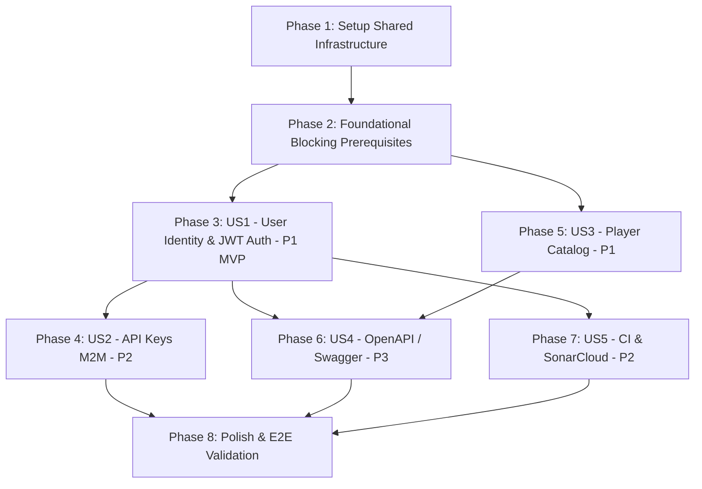

# Tasks: Plataforma de Mercado y Valoración de Jugadores — Entrega 1: Foundation

**Feature**: `001-entrega1-foundation`  
**Date**: 2026-09-16  
**Status**: Ready for Implementation  
**Spec**: [`specs/001-entrega1-foundation/spec.md`](./spec.md) | **Plan**: [`specs/001-entrega1-foundation/plan.md`](./plan.md)

---

## Phase 1: Setup (Shared Infrastructure)

**Purpose**: Inicialización del proyecto Maven, dependencias Spring Boot 3.x y estructura de directorios base del backend.

- [X] T001 Initialize Maven Spring Boot 3.x project configuration with dependencies (Web, Security, JPA, PostgreSQL, Validation, Springdoc, JJWT) in `back/pom.xml`
- [X] T002 [P] Configure repository `.gitignore` preventing secrets, local configs and target build artifacts in `back/.gitignore`
- [X] T003 [P] Create main application entry point class `PlayersMarketApplication.java` in `back/src/main/java/com/cbo/players/PlayersMarketApplication.java`
- [X] T004 [P] Configure application environment properties with PostgreSQL and JWT placeholders in `back/src/main/resources/application.yml`
- [X] T005 [P] Configure test properties profile in `back/src/test/resources/application-test.yml`

---

## Phase 2: Foundational (Blocking Prerequisites)

**Purpose**: Infraestructura transversal crítica que bloquea la implementación de las historias de usuario (Manejo global de errores RFC 7807 en español, enums de dominio, y base de seguridad).

**⚠️ CRITICAL**: Ninguna historia de usuario puede comenzar antes de completar esta fase.

- [X] T006 Define stable error codes enum `ErrorCode.java` with domain error constants in `back/src/main/java/com/cbo/players/exception/ErrorCode.java`
- [X] T007 [P] Create base exception classes `ApiException.java`, `ResourceNotFoundException.java`, `UserAlreadyExistsException.java`, and `InvalidCredentialsException.java` in `back/src/main/java/com/cbo/players/exception/`
- [X] T008 [P] Create field violation DTO `ViolationDto.java` in `back/src/main/java/com/cbo/players/dto/response/ViolationDto.java`
- [X] T009 Implement global exception handler `@RestControllerAdvice` returning RFC 7807 ProblemDetail in Spanish with errorCode, timestamp, and correlationId in `back/src/main/java/com/cbo/players/exception/GlobalExceptionHandler.java`
- [X] T010 [P] Define user role enum `UserRole.java` in `back/src/main/java/com/cbo/players/model/UserRole.java`
- [X] T011 [P] Define player position enum `PlayerPosition.java` in `back/src/main/java/com/cbo/players/model/PlayerPosition.java`
- [X] T012 Create Spring Security user principal wrapper `UserPrincipal.java` implementing `UserDetails` in `back/src/main/java/com/cbo/players/security/UserPrincipal.java`
- [X] T013 Create unit test for global exception handler `GlobalExceptionHandlerTest.java` in `back/src/test/java/com/cbo/players/exception/GlobalExceptionHandlerTest.java`

**Checkpoint**: Base transversal de errores, enums y modelos de seguridad lista.

---

## Phase 3: User Story 1 - Registro, Autenticación y Gestión de Identidad (Priority: P1) 🎯 MVP

**Goal**: Permitir a los usuarios registrarse con contraseñas encriptadas (BCrypt), iniciar sesión de forma segura y obtener un token JWT firmado para autenticar peticiones subsiguientes.

**Independent Test**: Invocar `POST /api/v1/auth/register` registrando un nuevo usuario (201 Created), verificar colisión por email duplicado (409 Conflict), autenticar con `POST /api/v1/auth/login` (200 OK con JWT) y comprobar rechazo ante credenciales erróneas (401 Unauthorized con mensaje en español).

### Tests for User Story 1

- [X] T014 [P] [US1] Unit test for JWT utility component `JwtTokenProviderTest.java` in `back/src/test/java/com/cbo/players/security/JwtTokenProviderTest.java`
- [X] T015 [P] [US1] Unit test for authentication business logic `AuthServiceTest.java` in `back/src/test/java/com/cbo/players/service/AuthServiceTest.java`
- [X] T016 [P] [US1] Web MVC integration test for register and login endpoints `AuthControllerTest.java` in `back/src/test/java/com/cbo/players/controller/AuthControllerTest.java`

### Implementation for User Story 1

- [X] T017 [P] [US1] Create JPA entity `User.java` with constraints, audit timestamps and BCrypt hash in `back/src/main/java/com/cbo/players/model/User.java`
- [X] T018 [P] [US1] Create Spring Data JPA repository `UserRepository.java` with lookup by username and email in `back/src/main/java/com/cbo/players/repository/UserRepository.java`
- [X] T019 [P] [US1] Create request DTOs `RegisterRequestDto.java` and `LoginRequestDto.java` with Spanish Bean Validation annotations in `back/src/main/java/com/cbo/players/dto/request/`
- [X] T020 [P] [US1] Create response DTOs `UserResponseDto.java` and `LoginResponseDto.java` in `back/src/main/java/com/cbo/players/dto/response/`
- [X] T021 [US1] Implement `CustomUserDetailsService.java` loading user by username for Spring Security in `back/src/main/java/com/cbo/players/security/CustomUserDetailsService.java`
- [X] T022 [US1] Implement JWT token generation, parsing, validation and secret management in `back/src/main/java/com/cbo/players/security/JwtTokenProvider.java`
- [X] T023 [US1] Implement JWT request filter `JwtAuthenticationFilter.java` validating `Bearer` token in `back/src/main/java/com/cbo/players/security/JwtAuthenticationFilter.java`
- [X] T024 [US1] Implement business logic for registration and login in `AuthService.java` in `back/src/main/java/com/cbo/players/service/AuthService.java`
- [X] T025 [US1] Implement authentication REST endpoints `register` and `login` in `AuthController.java` in `back/src/main/java/com/cbo/players/controller/AuthController.java`
- [X] T026 [US1] Configure Spring Security filter chain with BCrypt encoder and JWT filter in `back/src/main/java/com/cbo/players/security/SecurityConfig.java`

**Checkpoint**: User Story 1 completa y verificable independientemente como MVP.

---

## Phase 4: User Story 2 - Gestión y Validación de API Keys para Clientes M2M (Priority: P2)

**Goal**: Permitir a usuarios autenticados emitir API Keys para clientes programáticos, persistiendo únicamente su digest SHA-256 en base de datos y autorizando peticiones con header `X-API-Key`.

**Independent Test**: Obtener un JWT de US1, invocar `POST /api/v1/auth/api-keys` para generar una clave (201 Created con texto plano una sola vez), comprobar que en la base de datos solo se guardó el hash SHA-256, y autenticar peticiones usando el header `X-API-Key`.

### Tests for User Story 2

- [X] T027 [P] [US2] Unit test for API Key generation, hashing and validation `ApiKeyServiceTest.java` in `back/src/test/java/com/cbo/players/service/ApiKeyServiceTest.java`
- [X] T028 [P] [US2] Security integration test for `X-API-Key` header authentication `ApiKeyFilterTest.java` in `back/src/test/java/com/cbo/players/security/ApiKeyFilterTest.java`

### Implementation for User Story 2

- [X] T029 [P] [US2] Create JPA entity `ApiKey.java` with SHA-256 keyHash, prefix, status and ManyToOne relationship to User in `back/src/main/java/com/cbo/players/model/ApiKey.java`
- [X] T030 [P] [US2] Create Spring Data JPA repository `ApiKeyRepository.java` with `findByKeyHashAndActiveTrue` in `back/src/main/java/com/cbo/players/repository/ApiKeyRepository.java`
- [X] T031 [P] [US2] Create request DTO `CreateApiKeyRequestDto.java` and response DTO `ApiKeyCreatedResponseDto.java` in `back/src/main/java/com/cbo/players/dto/`
- [X] T032 [US2] Implement API Key generation (`cbo_live_...`), SHA-256 hashing and persistence in `ApiKeyService.java` in `back/src/main/java/com/cbo/players/service/ApiKeyService.java`
- [X] T033 [US2] Implement `ApiKeyAuthenticationFilter.java` intercepting `X-API-Key` header, validating hash and setting security context in `back/src/main/java/com/cbo/players/security/ApiKeyAuthenticationFilter.java`
- [X] T034 [US2] Add `createApiKey` endpoint in `AuthController.java` at `POST /api/v1/auth/api-keys` in `back/src/main/java/com/cbo/players/controller/AuthController.java`
- [X] T035 [US2] Register `ApiKeyAuthenticationFilter` into Spring Security filter chain in `back/src/main/java/com/cbo/players/security/SecurityConfig.java`

**Checkpoint**: User Story 1 y 2 completamente operativas de forma desacoplada.

---

## Phase 5: User Story 3 - Catálogo Inicial de Jugadores (Priority: P1)

**Goal**: Exponer el catálogo de jugadores registrados con endpoints para listado general y detalle individual por ID, tolerando `birthDate` nulo y sin exponer entidades JPA directas.

**Independent Test**: Consultar `GET /api/v1/players` recibiendo `List<PlayerResponseDto>` (200 OK), consultar `GET /api/v1/players/{id}` existente (200 OK), consultar ID inexistente recibiendo `ProblemDetail` con `PLAYER_NOT_FOUND` (404 Not Found), y verificar que `birthDate` puede ser nulo sin errores.

### Tests for User Story 3

- [X] T036 [P] [US3] Unit test for player query operations `PlayerServiceTest.java` in `back/src/test/java/com/cbo/players/service/PlayerServiceTest.java`
- [X] T037 [P] [US3] Web MVC controller test for player catalog endpoints `PlayerControllerTest.java` in `back/src/test/java/com/cbo/players/controller/PlayerControllerTest.java`

### Implementation for User Story 3

- [X] T038 [P] [US3] Create JPA entity `Player.java` with nullable `birthDate` and domain fields in `back/src/main/java/com/cbo/players/model/Player.java`
- [X] T039 [P] [US3] Create baseline JPA entity `PlayerQuote.java` representing quote history (without calculation logic) in `back/src/main/java/com/cbo/players/model/PlayerQuote.java`
- [X] T040 [P] [US3] Create Spring Data JPA repositories `PlayerRepository.java` and `PlayerQuoteRepository.java` in `back/src/main/java/com/cbo/players/repository/`
- [X] T041 [P] [US3] Create DTO `PlayerResponseDto.java` mapping player attributes and nullable birthDate in `back/src/main/java/com/cbo/players/dto/response/PlayerResponseDto.java`
- [X] T042 [US3] Implement business logic for player listing and retrieval by ID in `PlayerService.java` in `back/src/main/java/com/cbo/players/service/PlayerService.java`
- [X] T043 [US3] Implement REST endpoints `GET /api/v1/players` and `GET /api/v1/players/{id}` in `PlayerController.java` in `back/src/main/java/com/cbo/players/controller/PlayerController.java`
- [X] T044 [P] [US3] Create seed dataset script `data.sql` with initial catalog players in `back/src/main/resources/data.sql`
- [X] T045 [US3] Configure Spring Security authorization rules for `/api/v1/players/**` requiring authenticated JWT or valid API Key in `back/src/main/java/com/cbo/players/security/SecurityConfig.java`

**Checkpoint**: Catálogo de jugadores de Entrega 1 funcionando con persistencia y DTOs.

---

## Phase 6: User Story 4 - Documentación Swagger / OpenAPI v3 (Priority: P3)

**Goal**: Proveer documentación interactiva completa navegable en `/swagger-ui/index.html` y especificación OpenAPI v3 en `/v3/api-docs` para todos los endpoints de la Entrega 1.

**Independent Test**: Navegar a `http://localhost:8080/swagger-ui/index.html` sin credenciales, verificar la renderización visual de los endpoints de autenticación y jugadores, y consumir `http://localhost:8080/v3/api-docs` validando el esquema JSON OpenAPI 3.0.3.

### Implementation for User Story 4

- [X] T046 [P] [US4] Configure springdoc-openapi metadata, server URLs and security schemes (Bearer JWT + X-API-Key) in `back/src/main/java/com/cbo/players/config/OpenApiConfig.java`
- [X] T047 [US4] Add OpenAPI documentation annotations (`@Operation`, `@ApiResponse`, `@Tag`, `@Parameter`) on `AuthController.java` in `back/src/main/java/com/cbo/players/controller/AuthController.java`
- [X] T048 [US4] Add OpenAPI documentation annotations (`@Operation`, `@ApiResponse`, `@Tag`) on `PlayerController.java` in `back/src/main/java/com/cbo/players/controller/PlayerController.java`
- [X] T049 [US4] Configure public access in Spring Security for `/swagger-ui/**`, `/v3/api-docs/**`, and `/swagger-ui.html` in `back/src/main/java/com/cbo/players/security/SecurityConfig.java`
- [X] T050 [P] [US4] Integration test verifying public accessibility of `/v3/api-docs` and `/swagger-ui/index.html` in `back/src/test/java/com/cbo/players/config/OpenApiDocsTest.java`

**Checkpoint**: Documentación OpenAPI interactiva 100% disponible.

---

## Phase 7: User Story 5 - CI/DevOps y Calidad SonarCloud (Priority: P2)

**Goal**: Configurar el pipeline de integración continua en GitHub Actions ejecutando compilación, suite de tests y análisis en SonarCloud manteniendo menos de 10 issues totales.

**Independent Test**: Ejecutar el workflow en GitHub Actions ante un `push` o `pull_request`, verificando estado final `SUCCESS` y reporte en SonarCloud con máximo 9 issues (bugs, vulnerabilidades y code smells combinados).

### Implementation for User Story 5

- [X] T051 [P] [US5] Configure JaCoCo code coverage plugin and SonarCloud Maven plugin in `back/pom.xml`
- [X] T052 [US5] Create GitHub Actions workflow file `.github/workflows/ci.yml` with JDK 17 setup, Maven build, test execution and SonarCloud scan step in `.github/workflows/ci.yml`
- [X] T053 [P] [US5] Configure SonarCloud project properties (organization, projectKey, coverage exclusions) in `back/sonar-project.properties`

**Checkpoint**: Pipeline de CI y Quality Gate en SonarCloud configurados y verificables.

---

### Phase 8: Polish & Cross-Cutting Concerns

**Purpose**: Verificaciones finales, aseguramiento de no exposición de secretos y validación de extremo a extremo.

- [X] T054 Verify all functional exception messages and Bean Validation constraints are 100% in Spanish across all DTOs and Services
- [X] T055 [P] Audit codebase ensuring no secrets, JWT keys, real credentials or DB passwords are committed in repository
- [X] T056 Execute full validation suite per `quickstart.md` scenarios verifying sub-100ms response times and RFC 7807 error responses
- [X] T057 Run `mvn clean verify` validating that 100% of unit tests pass and code quality adheres to SonarCloud < 10 issues threshold

---

## Dependencies & Execution Order

### Phase Dependencies

- **Phase 1 (Setup)**: Sin dependencias previas.
- **Phase 2 (Foundational)**: Requiere Phase 1. Bloquea todas las historias de usuario.
- **Phase 3 (US1 - MVP)**: Requiere Phase 2. No depende de otras historias de usuario.
- **Phase 4 (US2 - API Keys)**: Requiere Phase 3 (US1) porque las API Keys se emiten a partir de un usuario autenticado por JWT.
- **Phase 5 (US3 - Players)**: Requiere Phase 2. Puede desarrollarse en paralelo con US1/US2.
- **Phase 6 (US4 - OpenAPI)**: Requiere controllers de US1 y US3 para anotar la documentación.
- **Phase 7 (US5 - CI/SonarCloud)**: Puede configurarse en paralelo tras tener tests de US1 y US3.
- **Phase 8 (Polish)**: Requiere todas las historias de usuario implementadas.

---

## Parallel Execution Opportunities

### Parallel Opportunities within Phases

- **Phase 1**: T002 (`.gitignore`), T003 (`PlayersMarketApplication`), T004 (`application.yml`) y T005 (`application-test.yml`) pueden ejecutarse en paralelo.
- **Phase 2**: T007 (Exceptions), T008 (`ViolationDto`), T010 (`UserRole`) y T011 (`PlayerPosition`) pueden desarrollarse en paralelo.
- **Phase 3**: Tests T014, T015, T016 pueden escribirse en paralelo. Entidades T017 y DTOs T019, T020 pueden crearse en paralelo.
- **Phase 4**: Tests T027 y T028 pueden escribirse en paralelo. Entidad T029 y DTOs T031 en paralelo.
- **Phase 5**: Tests T036 y T037 en paralelo. Entidades T038 (`Player`), T039 (`PlayerQuote`), DTO T041 y seed T044 en paralelo.

### Team Distribution Strategy

- **Desarrollador A**: Foco en Seguridad (US1 Auth JWT + US2 API Keys).
- **Desarrollador B**: Foco en Dominio (US3 Player Catalog + PlayerQuote + Data seed).
- **Desarrollador C / DevOps**: Foco en Infraestructura (US4 OpenAPI config + US5 CI GitHub Actions / SonarCloud).

---

## Implementation Strategy & MVP

1. **Paso 1**: Completar Setup (Fase 1) y Foundational (Fase 2).
2. **Paso 2**: Implementar User Story 1 (Fase 3). **Punto de corte MVP**: Validar registro, login y JWT de forma independiente.
3. **Paso 3**: Implementar User Story 3 (Fase 5). Validar catálogo de jugadores y DTOs con `birthDate` nullable.
4. **Paso 4**: Implementar User Story 2 (Fase 4). Validar emisión y autenticación con API Keys.
5. **Paso 5**: Incorporar User Story 4 (Fase 6) para documentación Swagger UI interactiva.
6. **Paso 6**: Configurar User Story 5 (Fase 7) en CI GitHub Actions y SonarCloud.
7. **Paso 7**: Completar Fase 8 de verificación y pulido final.
