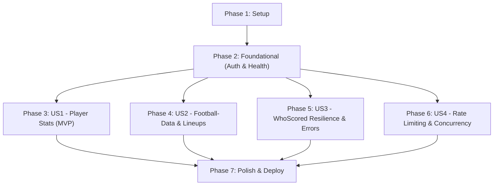

# Tasks: Microservicio de Datos Externos (WhoScored & Football-Data.org)

**Feature**: `002-player-scraper` | **Date**: 2026-09-22 | **Spec**: [specs/002-scrapper/spec.md](file:///c:/Users/vhba0/Documents/Estudios/UNQ/TPI/CBO/Desarrollo/202602-GrupoH/specs/002-scrapper/spec.md) | **Plan**: [specs/002-scrapper/plan.md](file:///c:/Users/vhba0/Documents/Estudios/UNQ/TPI/CBO/Desarrollo/202602-GrupoH/specs/002-scrapper/plan.md)

Este documento desglosa en tareas atómicas y ordenadas por dependencias la implementación completa del microservicio `/scraping` en Node.js, cubriendo la extracción dinámica de estadísticas y alineaciones de WhoScored, la integración de partidos y fixtures de Football-Data.org, y el despliegue en `docker-compose.yml`.

---

## Phase 1: Setup (Shared Infrastructure)

**Purpose**: Inicialización del proyecto `/scraping`, fijación estricta de dependencias y configuración de Docker.

- [X] T001 Initialize Node.js project directory structure for `/scraping` per implementation plan
- [X] T002 Create `scraping/package.json` with exact pinned dependencies (`express: 4.21.0`, `puppeteer: 23.4.0`, `bottleneck: 2.19.5`, `axios: 1.7.7`, `jest: 29.7.0`, `supertest: 7.0.0`, `nock: 13.5.5`)
- [X] T003 [P] Create `scraping/.env.example` and `scraping/.gitignore` with documented environment variables
- [X] T004 [P] Create `scraping/Dockerfile` based on `node:20-slim` with Chromium system dependencies (`libnss3`, `libatk1.0-0`, etc. via `apt-get`) and deterministic `npm ci` (sin instalar `curl` ni `wget` por opción B de healthcheck)
- [X] T005 [P] Commit `scraping/package-lock.json` generated from pinned dependencies to enable deterministic `npm ci`

---

## Phase 2: Foundational (Blocking Prerequisites)

**Purpose**: Infraestructura central de configuración, logging, manejo de errores estructurado y autenticación transversal `X-API-Key` activa desde el día uno para todos los endpoints de negocio, dejando público únicamente `GET /health`.

**⚠️ CRITICAL**: Ningún desarrollo de historias de usuario puede comenzar hasta completar esta fase. Todos los tests de integración subsiguientes asumen autenticación activa.

- [X] T006 Implement environment configuration loader in `scraping/src/config/env.js` (validating `PORT`, `API_KEY`, `FOOTBALL_DATA_API_KEY`, `SCRAPE_TIMEOUT_MS`, `MAX_RETRIES`, `MAX_CONCURRENT_SCRAPES`)
- [X] T007 [P] Implement structured error response formatter and custom error classes in `scraping/src/utils/errors.js`
- [X] T008 [P] Implement centralized error handling middleware in `scraping/src/middleware/errorHandler.js`
- [X] T009 [P] Implement structured request logging middleware in `scraping/src/middleware/logger.js`
- [X] T010 [P] Implement `X-API-Key` authentication middleware in `scraping/src/middleware/auth.js` comparing header against `env.API_KEY`
- [X] T011 [P] Add unit tests for `auth.js` in `scraping/tests/unit/authMiddleware.test.js` (valid key, missing key, invalid key -> 401 `UNAUTHORIZED`)
- [X] T012 Create Express server entry point in `scraping/src/index.js` mounting middleware, public `GET /health` endpoint (bypassing auth) and auth middleware for all business routes
- [X] T013 [P] Implement shared HTTP mocking helper with `nock` in `scraping/tests/helpers/httpMock.js` for Football-Data.org integration tests
- [X] T014 [P] Add integration test for public `GET /health` and auth rejection on protected routes in `scraping/tests/integration/healthAndAuth.test.js`

**Checkpoint**: Base de Express, configuración, autenticación transversal y health check listos. Las historias de usuario pueden implementarse a continuación.

---

## Phase 3: User Story 1 - Extracción y consulta de estadísticas crudas de jugador desde WhoScored (Priority: P1) 🎯 MVP

**Goal**: Exponer `GET /players/{whoscoredId}/stats` para devolver las 10 métricas cuantitativas del jugador extraídas vía scraping de WhoScored, normalizando valores vacíos a 0 y cancelando navegaciones ante desconexión del cliente.

**Independent Test**: Invocar `GET /players/{whoscoredId}/stats` con `X-API-Key` y verificar que retorne HTTP 200 con un JSON conteniendo exactamente los 10 campos requeridos (`goals`, `assists`, `shots`, `keyPasses`, `dribbles`, `tackles`, `rating`, `minutosJugados`, `tarjetasAmarillas`, `tarjetasRojas`) con valores numéricos válidos.

### Tests for User Story 1
- [X] T015 [P] [US1] Create WhoScored HTML fixtures (`player-stats.html` and `player-empty.html`) in `scraping/tests/fixtures/whoscored/`
- [X] T016 [P] [US1] Add unit tests for player stats parsing and normalization in `scraping/tests/unit/playerScraper.test.js` using local HTML fixtures
- [X] T017 [US1] Add integration test for `GET /players/:whoscoredId/stats` endpoint in `scraping/tests/integration/playerStats.test.js` using `X-API-Key`

### Implementation for User Story 1
- [X] T018 [P] [US1] Implement string and number normalizer in `scraping/src/utils/normalizer.js` (coercing dashes, nulls and strings to numeric 0 or 0.0)
- [X] T019 [US1] Implement Chromium headless browser pool manager in `scraping/src/services/whoscored/browserPool.js`
- [X] T020 [US1] Implement WhoScored player stats DOM extractor in `scraping/src/services/whoscored/playerScraper.js`
- [X] T021 [US1] Implement PlayerController in `scraping/src/controllers/playerController.js` handling `GET /players/:whoscoredId/stats` and listening to `req.on('close')` to abort pending page navigations
- [X] T022 [US1] Register `/players` route in `scraping/src/index.js`

**Checkpoint**: User Story 1 completada y funcional de manera autónoma como MVP.

---

## Phase 4: User Story 2 - Consulta de resultados y fixtures desde Football-Data.org con fallback de alineaciones a WhoScored (Priority: P2)

**Goal**: Exponer consulta de partidos por competición (`GET /competitions/{competitionCode}/matches`), detalle de partido (`GET /matches/{matchId}`) con mapeo completo de errores externos (404 `MATCH_NOT_FOUND`, 429 `RATE_LIMIT_EXCEEDED`, 401/403 `EXTERNAL_API_AUTH_ERROR`), y fallback de alineaciones tácticas en WhoScored (`GET /lineups?homeTeam=...&awayTeam=...&date=...`) con validación de parámetros de entrada.

**Independent Test**: (a) Consultar partidos de Premier League y verificar normalización a `MatchFixture`, (b) consultar partido inexistente en Football-Data.org y verificar 404 `MATCH_NOT_FOUND`, y (c) consultar `GET /lineups` con `homeTeam=Arsenal&awayTeam=Chelsea&date=2026-09-20` y comprobar la extracción de titulares, suplentes, formaciones y `source: "WHOSCORED"`.

### Tests for User Story 2
- [X] T023 [P] [US2] Create Football-Data.org JSON fixtures (`matches-pl.json`, `match-detail.json`, `rate-limit-429.json`, `auth-error-401.json`) in `scraping/tests/fixtures/football-data/`
- [X] T024 [P] [US2] Create WhoScored lineup HTML fixtures (`match-lineup.html`, `match-fixtures-date.html`) in `scraping/tests/fixtures/whoscored/`
- [X] T025 [P] [US2] Add unit tests for input parameter validator in `scraping/tests/unit/validator.test.js`
- [X] T026 [P] [US2] Add unit tests for team name normalizer and matcher in `scraping/tests/unit/teamMatcher.test.js`
- [X] T027 [P] [US2] Add integration tests for matches endpoints and error mapping (404, 429, 401) in `scraping/tests/integration/matches.test.js` using `nock` helper
- [X] T028 [US2] Add integration tests for `GET /lineups` endpoint in `scraping/tests/integration/lineups.test.js` using HTML fixtures

### Implementation for User Story 2
- [X] T029 [P] [US2] Implement input parameter validator middleware in `scraping/src/middleware/validator.js` (validating `competitionCode` enum `PL|BL1|PD|SA|FL1`, `dateFrom`/`dateTo`/`date` format `YYYY-MM-DD`, and required `homeTeam`/`awayTeam` returning 400 `INVALID_REQUEST_PARAMS`)
- [X] T030 [P] [US2] Implement Football-Data.org REST client in `scraping/src/services/footballData/apiClient.js` injecting `X-Auth-Token` and mapping error statuses (404 to `MATCH_NOT_FOUND`, 429 to `RATE_LIMIT_EXCEEDED`, 401/403 to `EXTERNAL_API_AUTH_ERROR`)
- [X] T031 [US2] Implement MatchController in `scraping/src/controllers/matchController.js` for `GET /competitions/:competitionCode/matches` and `GET /matches/:matchId`
- [X] T032 [P] [US2] Implement team name normalizer and WhoScored date fixture matcher in `scraping/src/services/whoscored/teamMatcher.js`
- [X] T033 [US2] Implement WhoScored lineup DOM extractor in `scraping/src/services/whoscored/lineupScraper.js`
- [X] T034 [US2] Implement LineupController in `scraping/src/controllers/lineupController.js` for `GET /lineups` handling request cancellation on `req.on('close')`
- [X] T035 [US2] Register `/competitions`, `/matches` and `/lineups` routes in `scraping/src/index.js` applying validation middleware

**Checkpoint**: User Stories 1 y 2 funcionan e integran de manera independiente.

---

## Phase 5: User Story 3 - Resiliencia y tipado de errores de WhoScored (Priority: P2)

**Goal**: Asegurar que las fallas de WhoScored (jugador inexistente, partido no encontrado para alineación, demoras de red, bloqueos anti-bot) respondan con códigos de error tipados (`PLAYER_NOT_FOUND`, `MATCH_NOT_FOUND`, `SCRAPE_TIMEOUT`, `SCRAPE_BLOCKED`), evitando en todo momento responder con un 500 genérico.

**Independent Test**: Simular un error 404, un timeout tras reintentos y un bloqueo 403 en los scrapers y comprobar que las respuestas HTTP sean 404, 504 y 502 respectivamente con el payload `ErrorResponse`.

### Tests for User Story 3
- [X] T036 [P] [US3] Create WhoScored not found HTML fixture (`not-found.html`) in `scraping/tests/fixtures/whoscored/`
- [X] T037 [P] [US3] Add integration tests for WhoScored error scenarios (404 `PLAYER_NOT_FOUND`, 404 `MATCH_NOT_FOUND`, 502 `SCRAPE_BLOCKED`, 504 `SCRAPE_TIMEOUT`) in `scraping/tests/integration/whoscoredErrors.test.js`

### Implementation for User Story 3
- [X] T038 [US3] Implement exponential backoff retry utility with jitter in `scraping/src/utils/retry.js`
- [X] T039 [US3] Integrate retry logic and structured error handling (`PLAYER_NOT_FOUND`, `SCRAPE_TIMEOUT`, `SCRAPE_BLOCKED`) into `scraping/src/services/whoscored/playerScraper.js`
- [X] T040 [US3] Integrate retry logic and structured error handling (`MATCH_NOT_FOUND`, `SCRAPE_TIMEOUT`, `SCRAPE_BLOCKED`) into `scraping/src/services/whoscored/lineupScraper.js`

**Checkpoint**: La extracción de WhoScored es tolerante a fallas y devuelve errores tipados según la constitución.

---

## Phase 6: User Story 4 - Control defensivo de concurrencia y rate limiting hacia fuentes externas (Priority: P3)

**Goal**: Aplicar throttling preventivo con Bottleneck a Football-Data.org (máx 10 req/min) con bypass en tests (`minTime: 0` cuando `NODE_ENV === 'test'`), y limitar la concurrencia de Chromium en WhoScored usando Bottleneck.

**Independent Test**: Disparar ráfagas de 15 llamadas simultáneas hacia Football-Data.org y verificar el encolamiento ordenado respetando el límite, y verificar que en entorno de test no haya bloqueos de 6 segundos entre pruebas.

### Tests for User Story 4
- [X] T041 [P] [US4] Add unit tests for Bottleneck rate limiter in `scraping/tests/unit/rateLimiter.test.js` verifying test-mode bypass (`minTime: 0` when `NODE_ENV === 'test'`) and production throttling configuration
- [X] T042 [US4] Add integration tests verifying concurrency regulation in `scraping/tests/integration/concurrency.test.js`

### Implementation for User Story 4
- [X] T043 [US4] Implement Bottleneck rate limiter (`reservoir: 10`, `minTime: 6000ms`, with `minTime: 0` when `NODE_ENV === 'test'`) in `scraping/src/services/footballData/rateLimiter.js` and wrap API calls in `apiClient.js`
- [X] T044 [US4] Configure concurrency limit (`MAX_CONCURRENT_SCRAPES`) using Bottleneck exclusively in `scraping/src/services/whoscored/browserPool.js`

**Checkpoint**: Ambas fuentes externas están protegidas contra rate limiting y saturación de recursos.

---

## Phase 7: Polish & Cross-Cutting Concerns

**Purpose**: Integración de infraestructura con Docker Compose con healthcheck, scripts de ejecución y validación completa del quickstart.

- [X] T045 Extend root `docker-compose.yml` adding the `scraper` service on `cbo_network` with Node-based healthcheck (`["CMD", "node", "-e", "require('http').get('http://localhost:3000/health', r => process.exit(r.statusCode === 200 ? 0 : 1)).on('error', () => process.exit(1))"]`) and env vars, without modifying `db` or `backend`
- [X] T046 Configure npm scripts (`test`, `dev`, `start`, `lint`) in `scraping/package.json`
- [X] T047 Execute end-to-end verification scenarios per `specs/002-scrapper/quickstart.md`
- [X] T048 [P] Update root `README.md` documenting the new `scraper` service in Docker Compose

---

## Dependencies & Execution Order

### Phase Dependencies

- **Setup (Phase 1)**: Inicialización del proyecto, sin dependencias previas.
- **Foundational (Phase 2)**: Depende de Phase 1. Implementa autenticación transversal `X-API-Key` y `GET /health`. Bloquea el inicio de las historias de usuario.
- **User Stories (Phase 3 a 6)**: Dependen de la finalización de Phase 2.
  - US1 (Stats) es el MVP y puede completarse primero.
  - US2 (Football-Data & Lineups) extiende el catálogo y maneja errores externos.
  - US3 robustece el scraping con reintentos y errores estructurados.
  - US4 añade el limitador Bottleneck y control de concurrencia.
- **Polish (Phase 7)**: Integra en `docker-compose.yml` con healthcheck y ejecuta la verificación global.

---

## Parallel Opportunities

- **Phase 1**: `T003` (.env.example/.gitignore), `T004` (Dockerfile) y `T005` (package-lock.json) se pueden realizar en paralelo tras `T002`.
- **Phase 2**: `T007` (errors), `T008` (errorHandler), `T009` (logger), `T010` (auth middleware), `T011` (auth unit tests) y `T013` (nock helper) son paralelizables.
- **Phase 3**: Fixtures `T015`, normalizador `T016` y unit tests `T017` pueden prepararse en paralelo.
- **Phase 4**: Fixtures `T023`, `T024`, validador `T025`, cliente HTTP `T026` y normalizador de equipos `T028` son paralelizables.
- **Phase 5**: Fixtures `T036` y tests de error `T037` son paralelizables.
- **Phase 6**: Unit tests `T041` son paralelizables.

---

## Implementation Strategy

### MVP First (User Story 1 Only)
1. Completar Phase 1 (Setup) y Phase 2 (Foundational con Auth y Health).
2. Implementar Phase 3 (User Story 1 - WhoScored player stats).
3. **Validación MVP**: Ejecutar `npm test` para verificar que `GET /players/:whoscoredId/stats` extrae las 10 métricas correctamente contra fixtures locales y exige `X-API-Key`.

### Incremental Delivery
1. **Incremento 1**: MVP WhoScored Player Stats autenticado (Phase 1, 2, 3).
2. **Incremento 2**: Integración Football-Data.org con validación de parámetros, errores mapeados y Fallback Lineups (Phase 4).
3. **Incremento 3**: Resiliencia y Tipado de Errores de WhoScored (Phase 5).
4. **Incremento 4**: Throttling preventivo Bottleneck con bypass en test y Concurrencia (Phase 6).
5. **Incremento 5**: Docker Compose con Healthcheck y validación Quickstart (Phase 7).
