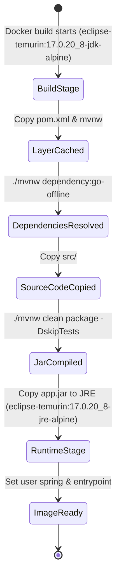
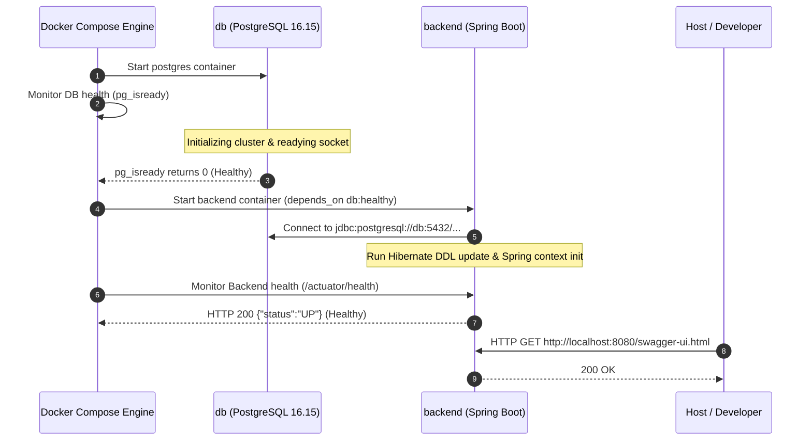

# Data Model & Configuration Schemas: Docker Infrastructure

**Feature**: `003-docker-backend-db`  
**Date**: 2026-09-22  
**Status**: Complete  

This document models the configuration entities, service parameters, state transitions, and persistent storage structures for the backend and database containerization.

---

## 1. Configuration Entities (Environment Model)

### 1.1 `EnvironmentConfiguration`
Defines the environment variables required for running the services via Docker Compose. Loaded from the local `.env` file (templated by `.env.example`).

| Field Name | Type | Default in Compose | Required | Description |
|------------|------|-------------------|----------|-------------|
| `POSTGRES_DB` | String | `cbo_players_db` | No | Target PostgreSQL database name. |
| `POSTGRES_USER` | String | `postgres` | No | Administrative username for PostgreSQL. |
| `POSTGRES_PASSWORD` | String | *None (strict)* | **Yes** | Secure administrative password. Must be provided in `.env`. Compose defines no fallback. |
| `POSTGRES_PORT` | Integer | `5432` | No | Host port forwarded to PostgreSQL container. |
| `BACKEND_PORT` | Integer | `8080` | No | Host port forwarded to backend application container. |
| `JWT_SECRET` | String (Base64) | *None (strict)* | **Yes** | HMAC-SHA256 secret key (minimum 256 bits). Must be provided in `.env`. Compose defines no fallback. |
| `JWT_EXPIRATION_MS` | Long | `86400000` | No | JWT expiration duration in milliseconds (default 24 hours). |

**Validation Rules**:
- `POSTGRES_PASSWORD` must have a non-trivial value (minimum 8 characters recommended) and must not be empty.
- `JWT_SECRET` must be at least 256 bits (32 bytes) when decoded to ensure HS256 compliance.
- Ports must be valid TCP port numbers between `1024` and `65535`.

---

## 2. Container & Service Entities

### 2.1 `DatabaseService` (`db`)
Represents the PostgreSQL database container instance.

- **Image**: `postgres:16.15-alpine` (pinned exact patch release)
- **Container Name**: `cbo-db`
- **Restart Policy**: `unless-stopped`
- **Networks**: `cbo_network`
- **Exposed / Mapped Ports**: `${POSTGRES_PORT:-5432}:5432`
- **Volume Mount**: `postgres_data:/var/lib/postgresql/data`
- **Environment Injections**:
  - `POSTGRES_DB: ${POSTGRES_DB:-cbo_players_db}`
  - `POSTGRES_USER: ${POSTGRES_USER:-postgres}`
  - `POSTGRES_PASSWORD: ${POSTGRES_PASSWORD}` *(strictly required, no fallback)*
- **Healthcheck Entity**:
  - **Command**: `pg_isready -U ${POSTGRES_USER:-postgres} -d ${POSTGRES_DB:-cbo_players_db}`
  - **Interval**: `5s`
  - **Timeout**: `5s`
  - **Retries**: `5`
  - **Start Period**: `10s`

### 2.2 `BackendService` (`backend`)
Represents the Spring Boot backend application container instance.

- **Build Context**: `./back`
- **Dockerfile**: `Dockerfile`
  - **Builder Base Image**: `eclipse-temurin:17.0.20_8-jdk-alpine` (pinned patch release)
  - **Runtime Base Image**: `eclipse-temurin:17.0.20_8-jre-alpine` (pinned patch release)
- **Container Name**: `cbo-backend`
- **Restart Policy**: `unless-stopped`
- **Networks**: `cbo_network`
- **Exposed / Mapped Ports**: `${BACKEND_PORT:-8080}:8080`
- **Dependencies**: `db` (`condition: service_healthy`)
- **Environment Injections**:
  - `DB_URL: jdbc:postgresql://db:5432/${POSTGRES_DB:-cbo_players_db}`
  - `DB_USERNAME: ${POSTGRES_USER:-postgres}`
  - `DB_PASSWORD: ${POSTGRES_PASSWORD}` *(strictly required, no fallback)*
  - `JWT_SECRET: ${JWT_SECRET}` *(strictly required, no fallback)*
  - `JWT_EXPIRATION_MS: ${JWT_EXPIRATION_MS:-86400000}`
- **Healthcheck Entity**:
  - **Command**: `wget -qO- http://localhost:8080/actuator/health || exit 1`
  - **Interval**: `10s`
  - **Timeout**: `5s`
  - **Retries**: `5`
  - **Start Period**: `30s`

---

## 3. Storage & Network Entities

### 3.1 `StorageVolume` (`postgres_data`)
- **Type**: Docker Named Volume.
- **Driver**: `local` (default).
- **Target Path in Container**: `/var/lib/postgresql/data`
- **Persistence Scope**:
  - Survives `docker compose down` and system reboots.
  - Destroyed **only** when explicitly instructed via `docker compose down -v`.

### 3.2 `NetworkTopology` (`cbo_network`)
- **Type**: Bridge network (`driver: bridge`).
- **Scope**: Local Docker Compose project.
- **DNS Resolution**:
  - Container name `db` resolves to internal IP on `cbo_network:5432`.
  - Container name `backend` resolves to internal IP on `cbo_network:8080`.
- **Extensibility**:
  - Future services (`scraping`, `frontend`) will declare `networks: - cbo_network` to communicate seamlessly without port collisions on host.

---

## 4. State Transitions & Lifecycle

### 4.1 Multi-Stage Build Lifecycle

### 4.2 Service Startup & Health State Transitions

