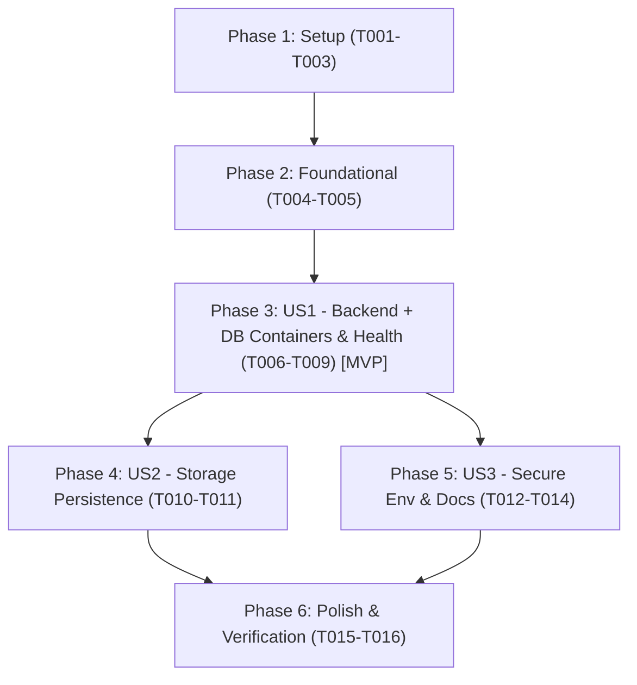

# Tasks: Dockerización de Backend + Base de Datos

**Feature**: `003-docker-backend-db`  
**Date**: 2026-09-22  
**Input**: Plan from `specs/003-docker-backend-db/plan.md`, Spec from `specs/003-docker-backend-db/spec.md`  

---

## Phase 1: Setup (Shared Infrastructure)

**Purpose**: Preparar dependencias del proyecto backend y verificar exclusiones de control de versiones.

- [X] T001 Verify and ensure `.env` file patterns are ignored in `.gitignore` and `back/.gitignore`
- [X] T002 [P] Add `spring-boot-starter-actuator` dependency to `back/pom.xml` for health monitoring
- [X] T003 [P] Configure Spring Security to permit public access to `/actuator/health` in `back/src/main/java/com/cbo/players/security/SecurityConfig.java`

---

## Phase 2: Foundational (Blocking Prerequisites)

**Purpose**: Infraestructura compartida requerida antes de levantar los servicios containerizados.

**⚠️ CRITICAL**: No container service work can begin until these foundational configurations are in place.

- [X] T004 Create template configuration file `.env.example` in repo root with environment variables matrix per `specs/003-docker-backend-db/contracts/environment-contract.md`
- [X] T005 [P] Initialize base `docker-compose.yml` in repo root with bridge network `cbo_network` and top-level volume `postgres_data` per `specs/003-docker-backend-db/contracts/docker-compose-contract.md`

**Checkpoint**: Foundation ready - user story implementations can proceed.

---

## Phase 3: User Story 1 - Contenerización del Backend y Base de Datos con Healthchecks (Priority: P1) 🎯 MVP

**Goal**: Permitir levantar el backend Spring Boot y PostgreSQL mediante Docker Compose con healthchecks coordinados (`pg_isready` y `/actuator/health`) sin requerir Java ni Postgres instalados localmente.

**Independent Test**: Ejecutar `docker compose up --build -d` con un `.env` válido, comprobar con `docker compose ps` que ambos contenedores reportan estado `healthy`, y verificar respuesta HTTP 200 en `http://localhost:8080/actuator/health`.

### Implementation for User Story 1

- [X] T006 [US1] Create multi-stage `back/Dockerfile` with builder (`eclipse-temurin:17.0.20_8-jdk-alpine`) using layer-cached `./mvnw dependency:go-offline` and runtime (`eclipse-temurin:17.0.20_8-jre-alpine`) with non-root user `spring`
- [X] T007 [US1] Configure service `db` with pinned image `postgres:16.15-alpine`, strict password variable without fallback, and `pg_isready` healthcheck in `docker-compose.yml`
- [X] T008 [US1] Configure service `backend` with build context `./back`, `depends_on` db healthy condition, datasource environment variables, and actuator healthcheck probe in `docker-compose.yml`
- [X] T009 [US1] Validate end-to-end container startup and health probe response with `docker compose up --build -d` and `curl http://localhost:8080/actuator/health` per `specs/003-docker-backend-db/quickstart.md`

**Checkpoint**: User Story 1 is fully functional and testable independently.

---

## Phase 4: User Story 2 - Persistencia de Datos mediante Volumen (Priority: P2)

**Goal**: Garantizar que los datos y tablas creadas en PostgreSQL se preserven a través de reinicios y recreaciones de contenedores con `docker compose down` y `docker compose up`.

**Independent Test**: Verificar mediante `docker compose exec db psql -U postgres -d cbo_players_db -c "\dt"` que las tablas persisten tras un ciclo de `docker compose down` y `docker compose up -d` (sin `-v`).

### Implementation for User Story 2

- [X] T010 [US2] Mount named volume `postgres_data:/var/lib/postgresql/data` into service `db` within `docker-compose.yml`
- [X] T011 [US2] Validate persistence lifecycle by restarting containers (`docker compose down` followed by `docker compose up -d`) and checking schema retention per `specs/003-docker-backend-db/quickstart.md`

**Checkpoint**: User Stories 1 and 2 are functional and verifiable.

---

## Phase 5: User Story 3 - Configuración Segura de Entorno y Documentación (Priority: P3)

**Goal**: Garantizar que un nuevo desarrollador pueda clonar el repositorio, configurar sus credenciales vía `.env.example`, validar que el sistema falle explícitamente si faltan variables obligatorias, y levantar el entorno siguiendo el README sin tocar `/front` ni `/scraping`.

**Independent Test**: Verificar fallo explícito al ejecutar compose sin `POSTGRES_PASSWORD` o `JWT_SECRET`, y comprobar que `git status` no reporta cambios en `/front` ni `/scraping`.

### Implementation for User Story 3

- [X] T012 [P] [US3] Verify strict error behavior when `POSTGRES_PASSWORD` or `JWT_SECRET` is unset in `.env` per `specs/003-docker-backend-db/contracts/environment-contract.md`
- [X] T013 [P] [US3] Document environment setup and Docker Compose execution commands (`cp .env.example .env`, `docker compose up --build`) in `README.md`
- [X] T014 [US3] Verify scope isolation ensuring zero modifications in `/front` and `/scraping` directories via `git status -s`

**Checkpoint**: All user stories complete and documented.

---

## Phase 6: Polish & Cross-Cutting Concerns

**Purpose**: Validaciones globales, optimizaciones de build y verificación final de la guía de inicio rápido.

- [X] T015 [P] Verify Docker build layer caching by modifying a Java file and confirming dependencies are not re-downloaded
- [X] T016 Execute full teardown scenarios (`docker compose down` and `docker compose down -v`) from `specs/003-docker-backend-db/quickstart.md`

---

## Dependencies & Execution Order

### Phase Dependencies

- **Setup (Phase 1)**: No dependencies - can start immediately.
- **Foundational (Phase 2)**: Depends on Phase 1 - blocks all User Stories.
- **User Story 1 (Phase 3 - MVP)**: Depends on Phase 2 completion.
- **User Story 2 (Phase 4)**: Depends on US1 service definitions.
- **User Story 3 (Phase 5)**: Depends on US1 & US2 for final environment validation.
- **Polish (Phase 6)**: Depends on completion of all desired user stories.

### User Story Dependencies

### Parallel Opportunities

- In Phase 1: `T002` (`back/pom.xml`) and `T003` (`SecurityConfig.java`) can run in parallel.
- In Phase 2: `T005` (`docker-compose.yml`) can run in parallel with `T004` (`.env.example`).
- In Phase 5: `T012` (env validation) and `T013` (`README.md`) can run in parallel.
- In Phase 6: `T015` (caching check) can run in parallel with final doc reviews.

---

## Implementation Strategy

### MVP First (User Story 1 Only)
1. Execute Phase 1: Setup (`T001`-`T003`).
2. Execute Phase 2: Foundational (`T004`-`T005`).
3. Execute Phase 3: User Story 1 (`T006`-`T009`).
4. **STOP and VALIDATE**: Verify containers reach healthy status and respond to `/actuator/health`.

### Incremental Delivery
1. **Increment 1 (MVP)**: Working containers for backend + Postgres with healthchecks (`T001`-`T009`).
2. **Increment 2**: Named volume persistence verified across container teardown/reboot (`T010`-`T011`).
3. **Increment 3**: Documentation in README, strict secret handling, and scope isolation verification (`T012`-`T014`).
4. **Increment 4**: Cache optimization review and clean teardown (`T015`-`T016`).
